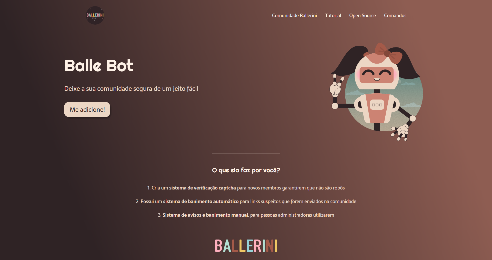

# Como criar uma Landing Page com HTML e CSS

## Itens importantes para o processo:

* [Visual Studio Code](https://code.visualstudio.com/Download)
* [Design da Página no Figma](https://www.figma.com/file/myqP66iQwzjwjrIAJyyrip/BalleBot?node-id=0%3A1)
* [Google Fonts](https://fonts.google.com/)
* [Guia do Flexbox](https://css-tricks.com/snippets/css/a-guide-to-flexbox/)
* [Comunidade Ballerini no Discord](https://discord.com/invite/wagxzStdcR)

<table>
  <tr>
    <td width="450"><h3>Vídeo passo a passo criação da Landing Page:</h3></td>
    <td valign="top" width="267"></td>
  </tr>
  <tr>
    <td valign="top" colspan="2"><h3 align="center">Landing Page</h3></td> <!-- Substituir link ou removê-lo -->
  </tr>
</table>